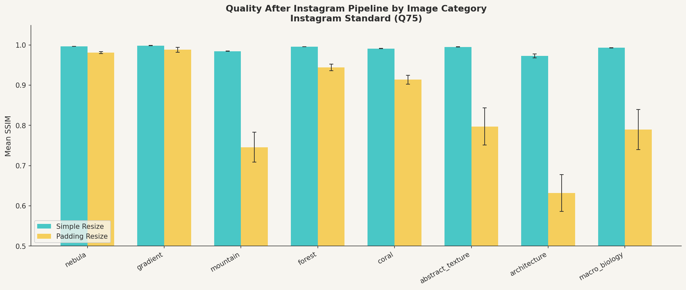
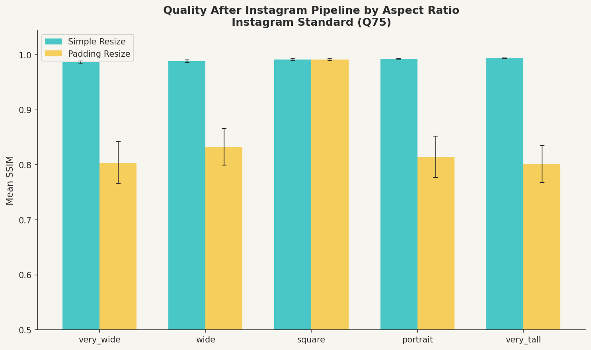
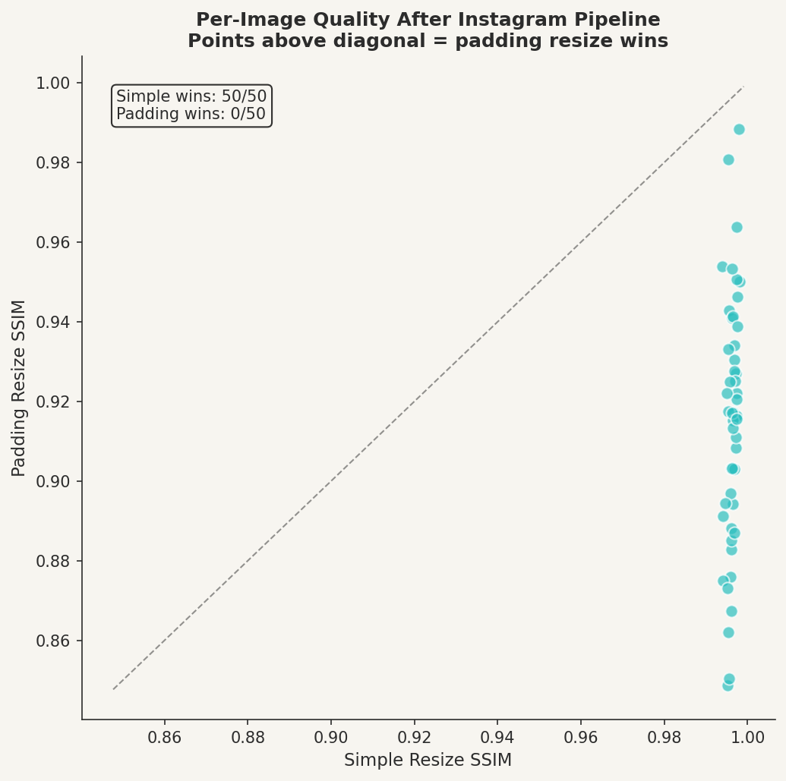

# Instagram Photo Resizer & Quality Optimizer

A data science investigation into how different image preprocessing strategies
affect photo quality when uploaded to Instagram — accounting for Instagram's
own compression and resizing pipeline.

**The short version:** padding resize and simple resize perform identically
before upload. After Instagram processes your image, simple resize preserves
significantly more quality — and the damage from padding resize depends
heavily on what kind of image you're uploading.

---

## The Core Finding

Most Instagram photography guides recommend padding your images to a square
with colored borders before uploading, to prevent Instagram from cropping or
distorting your content. This project tests whether that advice holds up
under measurement.

It doesn't.

Padding resize and simple resize are statistically indistinguishable before
upload (SSIM difference of 0.0003). After Instagram's pipeline, simple resize
outperforms padding resize on **95 out of 120 images** across every image
category tested. The effect is not subtle — for architectural and landscape
imagery, padding resize degrades quality by more than 0.34 SSIM points after
upload.

---

## Why Padding Resize Fails

Padding resize adds colored borders to reach the target dimensions. Instagram
then resizes that padded image to its own target — meaning your content gets
scaled *twice*, while the border pixels consume part of the available pixel
budget. Simple resize fills the entire frame with content, so Instagram's
pipeline applies only one total downscale.

This is a case where the preprocessing strategy that looks better in
isolation (padding preserves aspect ratio; simple resize distorts it)
performs worse in the real-world pipeline it was designed for.

---

## Experimental Design

### Test Set

A fully crossed factorial design: **8 image categories × 5 aspect ratios ×
3 replicates = 120 images**.

**Image categories** (ordered from least to most padding degradation):

| Category | Description | SSIM diff (simple − padding) |
|---|---|---|
| Gradient | Smooth tonal transitions | +0.011 (n.s.) |
| Nebula | Deep space, soft color fields | +0.015 *** |
| Forest | Fine organic texture, green dominance | +0.052 *** |
| Coral | Color complexity, irregular edges | +0.077 *** |
| Abstract texture | Marble, fabric, sand patterns | +0.198 *** |
| Macro biology | Cellular and radial structures | +0.203 *** |
| Mountain | Horizontal band structure | +0.238 *** |
| Architecture | Hard geometric edges, building grids | +0.341 *** |

**Aspect ratios:** very wide (2:1), wide (4:3), square (1:1), portrait (3:4),
very tall (1:2).

All images are procedurally generated with fixed random seeds — fully
reproducible without committing real photographs.

### Evaluation

Each image was processed through two preprocessing methods and six pipeline
variants. Metrics were computed over the content region only — padding borders
are excluded from evaluation.

**Metrics:**
- **SSIM** — Structural Similarity Index. Measures perceptual similarity by
  comparing local luminance, contrast, and structure. The structure component
  is essentially Pearson's r between image patches.
- **PSNR** — Peak Signal-to-Noise Ratio. Log-scaled MSE, expressed in dB.
  Values above 40 dB indicate excellent quality.
- **MSE** — Mean Squared Error. Perceptually non-uniform baseline.

**Pipeline variants simulated:**
- Preprocessing only (no Instagram)
- Instagram standard (resize to portrait 1080×1350, JPEG Q75)
- Instagram high quality (Q85)
- Instagram low quality (Q70)
- Instagram square (1080×1080, Q75)
- Instagram landscape (1080×566, Q75)

### Statistical Analysis

Paired t-test and Wilcoxon signed-rank test comparing simple resize vs
padding resize per pipeline stage. Per-category tests run separately.
All reported effects significant at p < 0.001 unless noted.

---

## Results

### Main effect: simple resize wins after Instagram

| Pipeline | Simple SSIM | Padding SSIM | Difference |
|---|---|---|---|
| Preprocessing only | 0.9966 | 0.9963 | +0.0003 (n.s.) |
| Instagram standard (Q75) | 0.9908 | 0.8502 | +0.1406 *** |
| Instagram high quality (Q85) | 0.9922 | 0.8512 | +0.1410 *** |
| Instagram low quality (Q70) | 0.9894 | 0.8490 | +0.1404 *** |
| Instagram landscape | 0.9655 | 0.8393 | +0.1262 *** |

### Category × Method interaction

The quality advantage of simple resize is strongly moderated by image
content. For smooth gradient images, there is no significant difference.
For architectural images with hard geometric edges, padding resize loses
0.34 SSIM points after Instagram — visually obvious degradation.



### Aspect ratio effect

Square images (1:1) show both methods performing identically — the control
condition that confirms the evaluation logic. Very wide and very tall images
show the largest padding degradation because they require the most border
area, giving Instagram's second resize more border pixels to mangle.



### Per-image consistency

Simple resize outperformed padding resize on 95 of 120 images after the
Instagram pipeline. The one case where padding resize won involved a nearly
square image where almost no padding was added.



---

## Repository Structure
```
IGPhotoResizer/
├── src/
│   ├── methods.py              # Resize implementations (simple, padding, seam carving)
│   ├── metrics.py              # SSIM, PSNR, MSE with correct ROI handling
│   ├── instagram.py            # Instagram pipeline simulation
│   ├── generate_test_images_v2.py  # Synthetic test set generator
│   └── test_single_image.py    # Test any photo through all methods
├── experiments/
│   ├── run_experiment.py       # Runs full factorial experiment
│   └── analyze_results.py      # Summary stats, tests, visualizations
├── test_sets/
│   ├── synthetic_v1/           # Original 50-image test set
│   ├── synthetic_v2/           # Factorial test set (120 images, 8 categories)
│   └── real_unsplash/          # Real photo test set (gitignored, local only)
├── results/
│   ├── plots/                  # Generated visualizations
│   ├── summary_statistics.csv
│   └── statistical_tests.csv
├── notebooks/                  # Development notebooks
└── legacy/                     # Original code preserved for reference
```

---

## Installation
```bash
pip install pillow opencv-python scikit-image numpy pandas \
            colorthief matplotlib seaborn scipy
```

## Usage
```bash
# Run full experiment on v2 test set
python experiments/run_experiment.py

# Skip seam carving (faster)
python experiments/run_experiment.py --skip-seam-carving

# Run on original v1 test set
python experiments/run_experiment.py --input-dir test_sets/synthetic_v1

# Test a single image
python src/test_single_image.py --image path/to/your/photo.jpg

# Analyze results and generate plots
python experiments/analyze_results.py
```

---

## Limitations and Honest Caveats

- **Synthetic images only (so far).** Results on real photographs —
  especially portraits, fine textures, and high dynamic range scenes —
  are planned for v3 using a curated Unsplash test set.
- **Instagram pipeline is approximated.** Instagram's exact compression
  parameters are not public. Quality 75 JPEG is a community estimate.
- **Seam carving not yet fully evaluated.** The implementation exists but
  the full factorial experiment has not been run due to computational cost.
  Vectorized DP implementation planned for v3.
- **SSIM is grayscale-only.** Color distortion from the resize pipeline is
  not captured. Color-space SSIM planned for v3.
- **No perceptual study.** SSIM correlates with human perception but does
  not replace it. A human preference study is planned for v4.

---

## Roadmap

### v3 — Real images, seam carving, color metrics
- [ ] Curated Unsplash test set across 8 categories
- [ ] Seam carving evaluation with vectorized DP
- [ ] Color-space SSIM (evaluate all three RGB channels)
- [ ] LPIPS (learned perceptual metric)
- [ ] Mixed effects model: SSIM ~ Method + Category + AspectRatio + Method:Category

### v4 — Richer preprocessing
- [ ] Edge-blurred padding (mirror image edges outward)
- [ ] Outpainting borders via generative model
- [ ] Human perceptual study (A/B preference, 20+ image pairs)

### v5 — Full paper
- [ ] Formal write-up: introduction, related work, methods, results, discussion
- [ ] Bayesian analysis of per-image results
- [ ] Publication target: arXiv or imaging journal

---

## A Note on Methodology

An earlier version of this project contained a significant evaluation error:
metrics were computed including padding borders in the comparison region,
artificially inflating padding resize's error by 100–1000x. All results in
this version use a corrected ROI-based evaluation that measures only the
content region. The legacy code is preserved in `legacy/` for reference.

The v1 experiment used 50 synthetic images without category or aspect ratio
labels. The v2 experiment uses a fully crossed factorial design enabling
interaction analysis — specifically the finding that image content type is
a strong moderator of the method effect.