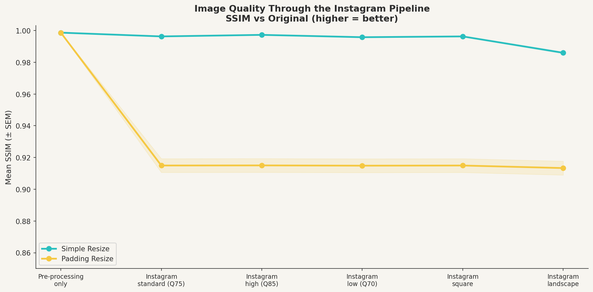

# Instagram Photo Resizer & Quality Optimizer

A data science investigation into how different image preprocessing strategies
affect photo quality when uploaded to Instagram — accounting for Instagram's
own compression and resizing pipeline.

**The short version:** padding resize and simple resize perform identically
before upload. After Instagram processes your image, simple resize preserves
significantly more quality. The reason is surprisingly non-obvious.

---

## The Problem

Instagram resizes images for multi-photo posts based on the first image
selected. When you upload a non-square photo, Instagram applies its own
resize and JPEG compression on top of whatever you uploaded. This means
your preprocessing choice doesn't just affect the image you upload — it
affects the image that *survives* Instagram's pipeline.

Most guides recommend padding your images to a square with white or black
borders before uploading, to prevent Instagram from cropping or distorting
your content. This project tests whether that advice holds up under
measurement.

---

## Methods

Three preprocessing strategies were evaluated:

**Simple Resize** resizes the image directly to 1080×1080 using LANCZOS
resampling. Does not preserve aspect ratio — content is squashed to fill
the square frame.

**Padding Resize** scales the image proportionally to fit within 1080×1080,
then fills the remaining space with the image's dominant color. Preserves
aspect ratio with no content distortion.

**Seam Carving** (in progress) removes low-energy pixel seams to resize
content-aware. True content-aware resize — preserves important content
by intelligently selecting which pixels to remove.

### Evaluation

Each method was evaluated using three image quality metrics:

- **SSIM** (Structural Similarity Index) — measures perceptual similarity
  by comparing local luminance, contrast, and structure. Based on a
  normalized local covariance, essentially Pearson's r between image patches.
- **PSNR** (Peak Signal-to-Noise Ratio) — logarithmic transform of MSE,
  expressed in decibels. Values above 40 dB indicate excellent quality.
- **MSE** (Mean Squared Error) — average squared pixel difference.
  Perceptually non-uniform but useful as a baseline.

Metrics were computed over the **content region only** — padding borders
are explicitly excluded from evaluation so methods are compared fairly.

### Instagram Pipeline Simulation

After preprocessing, each image was passed through a simulated Instagram
pipeline: resize to Instagram's target dimensions (1080×1350 portrait),
then JPEG compress at quality 75 (Instagram's approximate setting). This
was tested across five pipeline variants covering different post types and
compression levels.

### Test Set

50 synthetic images generated with a fixed random seed (reproducible),
ranging from 500×500 to 1000×1000 pixels with randomized aspect ratios,
solid color backgrounds, and overlapping geometric shapes.

---

## Results

### Before Instagram: methods are equivalent

Both methods preserve image quality equally well before upload. Mean SSIM
of 0.9987 for both simple and padding resize, with a difference of 0.000021
— statistically detectable at n=50 but practically meaningless.

### After Instagram: simple resize wins decisively

| Pipeline | Simple Resize SSIM | Padding Resize SSIM | Difference |
|---|---|---|---|
| Preprocessing only | 0.9987 | 0.9987 | +0.000021 |
| Instagram standard (Q75) | 0.9963 | 0.9150 | +0.0814 |
| Instagram high quality (Q85) | 0.9973 | 0.9150 | +0.0823 |
| Instagram low quality (Q70) | 0.9958 | 0.9149 | +0.0810 |
| Instagram landscape | 0.9860 | 0.9134 | +0.0726 |

Simple resize outperformed padding resize on **50 out of 50 images** after
the Instagram pipeline. Both paired t-test and Wilcoxon signed-rank test
confirm the difference is highly significant (p < 0.0001) across all
pipeline variants.

### Why padding resize fails downstream

Padding resize adds colored borders to reach the target dimensions.
Instagram then resizes that padded image to its own target — meaning the
content gets scaled *twice*, while the border pixels consume part of the
available pixel budget. Simple resize fills the entire frame with content,
so Instagram's pipeline applies only one total downscale.

This is a case where the preprocessing strategy that looks better in
isolation (padding preserves aspect ratio; simple resize distorts it)
performs worse in the real-world pipeline it was designed for.

### Aspect ratio moderately predicts degradation

Images with more extreme aspect ratios (further from 1:1 square) showed
slightly more quality degradation after the Instagram pipeline
(Pearson r = 0.353). More non-square images have larger border areas,
giving Instagram's resize more border pixels to mangle. However, aspect
ratio explains only a moderate share of the variance — the degradation
is largely consistent regardless of how extreme the original dimensions are.




---

## Repository Structure
```
IGPhotoResizer/
├── src/
│   ├── methods.py          # Resize implementations (simple, padding, seam carving)
│   ├── metrics.py          # SSIM, PSNR, MSE with correct ROI handling
│   └── instagram.py        # Instagram pipeline simulation
├── experiments/
│   ├── run_experiment.py   # Runs all methods × all images × all pipelines
│   └── analyze_results.py  # Summary stats, statistical tests, visualizations
├── results/
│   ├── plots/              # Generated visualizations
│   ├── summary_statistics.csv
│   └── statistical_tests.csv
├── notebooks/              # Development notebooks
├── legacy/                 # Original code preserved for reference
└── frozen_test_images/     # Fixed synthetic test set (seed=11, reproducible)
```

---

## Installation
```bash
pip install pillow opencv-python scikit-image numpy pandas \
            colorthief matplotlib seaborn scipy
```

## Usage
```bash
# Run full experiment (all methods, all pipeline variants)
python experiments/run_experiment.py

# Skip seam carving (much faster)
python experiments/run_experiment.py --skip-seam-carving

# Preprocessing quality only, no Instagram simulation
python experiments/run_experiment.py --no-instagram

# Analyze results and generate plots
python experiments/analyze_results.py
```

---

## Limitations and Honest Caveats

- **Synthetic test images only (so far).** The test set uses programmatically
  generated images with geometric shapes. Results on real photographs —
  especially portraits, landscapes, and fine textures — may differ.
- **Instagram pipeline is approximated.** Instagram's exact compression
  parameters are not public. Quality 75 JPEG is a community estimate.
- **Seam carving not yet evaluated.** The implementation exists but the
  full experiment has not been run due to computational cost.
- **SSIM is grayscale-only in this implementation.** Color distortion from
  the resize pipeline is not captured by the current metrics.
- **No perceptual study.** SSIM correlates with human perception but does
  not replace it. A human preference study is planned.

---

## Roadmap

### v2 — Real images and seam carving
- [ ] Run experiment on real photograph test set
- [ ] Complete seam carving evaluation with energy function comparison
- [ ] Add color-space SSIM (evaluate all three RGB channels)
- [ ] Add LPIPS (learned perceptual metric using neural features)

### v3 — Richer preprocessing
- [ ] Edge-blurred padding (mirror image edges outward instead of flat color)
- [ ] Investigate whether dominant color padding reduces degradation vs
      white padding on real images

### v4 — Outpainting borders
- [ ] Use a generative model to fill borders with scene-consistent content
- [ ] Compare outpainting vs flat color vs edge blur on human preference study

### v5 — Full paper
- [ ] Human perceptual study (A/B preference on 20+ image pairs)
- [ ] Formal write-up: introduction, related work, methods, results, discussion
- [ ] Bayesian analysis of per-image results
- [ ] Publication target: arXiv or undergraduate/graduate journal

---

## A Note on Methods

An earlier version of this project contained a significant evaluation error:
metrics were computed by resizing the processed image back to original
dimensions using the default (nearest-neighbor) resampling filter, then
comparing pixel-for-pixel including padding borders. This artificially
inflated padding resize's error by 100-1000x. All results in this version
use a corrected ROI-based evaluation. The legacy code is preserved in
`legacy/` for reference.